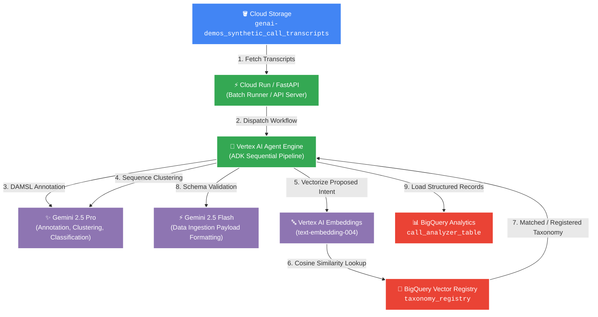
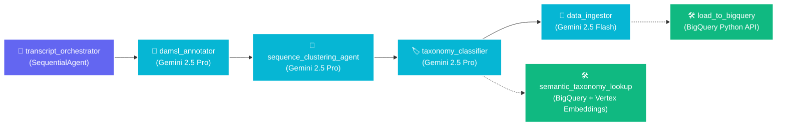

# 🎙️ Conversational Agent Transcript Analyzer & Ingestion Engine

[](https://www.python.org/)
[](https://github.com/google/adk)
[](https://cloud.google.com/vertex-ai)
[](https://cloud.google.com/bigquery)
[](https://fastapi.tiangolo.com/)
[](https://opensource.org/licenses/Apache-2.0)

An enterprise-grade, multi-agent conversational intelligence pipeline designed to ingest, annotate, cluster, classify, and warehouse call center transcripts at scale. Built with the **Google Agent Development Kit (ADK)**, **Vertex AI Gemini 2.5**, and **Google Cloud BigQuery**.

---

## 📑 Table of Contents

- [Overview](#-overview)
- [Key Features](#-key-features)
- [System Architecture](#-system-architecture)
  - [Cloud Infrastructure & Ingestion Flow](#cloud-infrastructure--ingestion-flow)
  - [Hierarchical Multi-Agent Framework](#hierarchical-multi-agent-framework)
- [Agent Specifications](#-agent-specifications)
- [Database Schema & Vector Registry](#-database-schema--vector-registry)
- [Project Structure](#-project-structure)
- [Prerequisites](#-prerequisites)
- [Quick Start & Installation](#-quick-start--installation)
  - [1. Clone & Environment Setup](#1-clone--environment-setup)
  - [2. Google Cloud Authentication](#2-google-cloud-authentication)
  - [3. BigQuery Resource Initialization](#3-bigquery-resource-initialization)
- [Running the Application](#-running-the-application)
  - [Interactive Playground](#interactive-playground)
  - [FastAPI Server & Live Admin Dashboard](#fastapi-server--live-admin-dashboard)
  - [Standalone GCS Batch Runner](#standalone-gcs-batch-runner)
- [REST API Reference](#-rest-api-reference)
- [Testing & Evaluation](#-testing--evaluation)
- [Deployment & CI/CD](#-deployment--cicd)
  - [Deploy to Google Cloud Run](#deploy-to-google-cloud-run)
  - [Docker Container Build](#docker-container-build)
- [Observability & Telemetry](#-observability--telemetry)
- [Contributing & Guidelines](#-contributing--guidelines)

---

## 🌟 Overview

The **Transcript Analyzer** transforms raw, unstructured customer support call logs into deeply structured, queryable analytics data. It utilizes a sequential chain of specialized Gemini agents to parse telephone dialogues turn-by-turn, categorize intents with vector-similarity deduplication, cluster conversational stages, and persist analytics-ready records directly into Google BigQuery.

---

## ⚡ Key Features

- 🏷️ **DAMSL Dialogue Act Annotation**: Turn-by-turn categorization adhering strictly to the **Jurafsky DAMSL protocol** (`STATEMENT`, `YES-NO-QUESTION`, `OPEN-QUESTION`, `AGREEMENT`, `BACKCHANNEL`, `COMMAND`, `APOLOGY`, `THANKING`, etc.) paired with abstractive 3-5 word summaries for every utterance.
- 🧩 **Sequential Activity Clustering**: Groups conversational turns into logical operational phases (*Opening & Authentication*, *Problem Discovery*, *Resolution Processing*, *Call Closing*), calculating precise elapsed duration metrics per phase while bypassing non-compliant financial estimates.
- 🧬 **High-Reuse Vector Taxonomy Registry**: Generates 768-dimensional embeddings via `text-embedding-004` and queries BigQuery using Cosine Distance (`ML.DISTANCE`). Automatically enforces a $\ge 0.80$ similarity threshold to merge synonymous call reasons and prevent taxonomy catalog fragmentation.
- 📊 **Automated BigQuery Warehousing**: Persists normalized nested records (`ARRAY<STRUCT>`) into `call_analyzer.call_analyzer_table` for downstream business intelligence, SQL analytics, and Looker Studio dashboards.
- 🖥️ **Live Admin Dashboard**: Built-in dark-themed, glassmorphic UI providing real-time pipeline monitoring, live ingestion progress bars, operational KPIs, intent reuse ratios, and structured transcript record inspection.
- 🚀 **Flexible Ingestion Modes**: Supports asynchronous GCS batch runs, background task triggers, Server-Sent Events (SSE) streaming, and interactive local playgrounds.

---

## 🏛️ System Architecture

### Cloud Infrastructure & Ingestion Flow



### Hierarchical Multi-Agent Framework

The system implements a sequential supervisor-worker pattern orchestrated through Google ADK:



---

## 🤖 Agent Specifications

| Agent Name | Model | Function & Responsibilities | Tools Attached |
| :--- | :--- | :--- | :--- |
| **`transcript_orchestrator`** | `SequentialAgent` | Top-level pipeline coordinator. Manages linear dependencies, state propagation, and final transaction reporting across sub-agents. | None (Coordinates sub-agents) |
| **`damsl_annotator`** | `gemini-2.5-pro` | Turn-by-turn utterance analysis against standard DAMSL act definitions. Outputs relative timestamps, speaker tags, verbatim text, DAMSL labels, and 3-5 word abstractive headings. | None |
| **`sequence_clustering_agent`** | `gemini-2.5-pro` | Identifies thematic phase boundaries (e.g., *Opening*, *Discovery*, *Resolution*, *Closing*). Computes elapsed duration in seconds for each activity sequence. | None |
| **`taxonomy_classifier`** | `gemini-2.5-pro` | Derives 2-layer intent hierarchy (Primary & Secondary scopes). Calls vector search to enforce standard label reuse when cosine similarity $\ge 0.80$. | `semantic_taxonomy_lookup` |
| **`data_ingestor`** | `gemini-2.5-flash` | Validates schema conformance against target BigQuery specifications and constructs the final unified nested payload. | `load_to_bigquery` |

---

## 🗄️ Database Schema & Vector Registry

### 1. Analytics Target Table (`call_analyzer.call_analyzer_table`)

Stores complete analyzed call transcripts with nested activity phases and dialogue act turns:

```sql
CREATE TABLE IF NOT EXISTS `genai-demos-391416.call_analyzer.call_analyzer_table` (
    call_id STRING NOT NULL,
    customer_id STRING NOT NULL,
    customer_name STRING,
    customer_type STRING,
    phone STRING,
    email STRING,
    services STRING,
    duration_minutes INT64,
    total_turns INT64,
    processed_timestamp TIMESTAMP DEFAULT CURRENT_TIMESTAMP(),
    primary_reason STRING NOT NULL,
    secondary_reason STRING NOT NULL,
    sequences ARRAY<STRUCT<
        sequence_name STRING,
        est_duration_seconds FLOAT64,
        turns ARRAY<STRUCT<
            timestamp STRING,
            speaker STRING,
            text STRING,
            dialogue_act STRING,
            abstractive_title STRING
        >>
    >>
);
```

### 2. Semantic Taxonomy Registry Table (`call_analyzer.taxonomy_registry`)

Maintains registered intent categories and their 768-dimension embeddings for semantic vector distance comparisons:

```sql
CREATE TABLE IF NOT EXISTS `genai-demos-391416.call_analyzer.taxonomy_registry` (
    primary_category STRING NOT NULL,
    secondary_category STRING NOT NULL,
    category_embedding ARRAY<FLOAT64>,
    created_at TIMESTAMP DEFAULT CURRENT_TIMESTAMP()
);
```

---

## 📂 Project Structure

```
transcript-analyzer/
├── app/
│   ├── agent.py               # ADK Multi-Agent definitions & orchestration logic
│   ├── fast_api_app.py        # FastAPI server, REST routes & interactive dashboard UI
│   ├── tools/
│   │   └── taxonomy_tools.py  # Vertex text-embedding-004 & BigQuery ML.DISTANCE lookup
│   └── app_utils/
│       ├── telemetry.py       # OpenTelemetry setup & Cloud Tracing configuration
│       └── typing.py          # Pydantic schemas & data models
├── Synthetic Calls/           # Synthetic call generation & dataset tools
│   ├── transcripts/           # Sample JSON transcripts (CALL-0001.json ... CALL-0100.json)
│   ├── call_specs.json        # Pre-configured call scenario profiles
│   ├── transcripts_generator.py # Transcript generation script
│   └── users_generator.py     # Customer mock profile generator
├── tests/
│   ├── unit/                  # Unit tests
│   ├── integration/           # E2E integration & FastAPI server tests
│   └── eval/                  # Agent evaluation datasets & configs
├── batch_runner.py            # Standalone GCS batch ingestion runner
├── setup_bq.py                # BigQuery dataset/table provisioning & seed script
├── Dockerfile                 # Production container definition
├── pyproject.toml             # Project dependencies & tool configurations
├── GEMINI.md                  # Development guidelines & operational constraints
└── README.md                  # Project documentation
```

---

## 📋 Prerequisites

Before running the project, ensure you have the following installed:

- **Python 3.12+**
- **[uv](https://docs.astral.sh/uv/)**: High-performance Python package and environment manager
- **[Google Cloud SDK (`gcloud`)](https://cloud.google.com/sdk/docs/install)**: For GCP authentication and service interaction
- **[google-agents-cli](https://github.com/google-gemini/agents-cli)**: CLI tool for ADK agents development:
  ```bash
  uv tool install google-agents-cli
  ```

---

## 🚀 Quick Start & Installation

### 1. Clone & Environment Setup

```bash
# Clone the repository
git clone https://github.com/wanderas-pixel/anatomy-of-a-call.git
cd anatomy-of-a-call

# Install dependencies using uv
agents-cli install
# or: uv sync
```

Create a `.env` file in the root directory:

```env
GEMINI_API_KEY=your_gemini_api_key_here
GOOGLE_CLOUD_PROJECT=genai-demos-391416
GOOGLE_CLOUD_LOCATION=us-central1
OTEL_SERVICE_NAME=Transcript Analyzer
OTEL_EXPORTER_OTLP_ENDPOINT=http://localhost:4318
GOOGLE_CLOUD_AGENT_ENGINE_ENABLE_TELEMETRY=true
OTEL_INSTRUMENTATION_GENAI_CAPTURE_MESSAGE_CONTENT=true
```

### 2. Google Cloud Authentication

Authenticate your local environment with Google Cloud Application Default Credentials (ADC):

```bash
gcloud auth application-default login
gcloud config set project genai-demos-391416
```

### 3. BigQuery Resource Initialization

Run the automated setup script to provision the dataset, generate target tables, and seed baseline taxonomies:

```bash
uv run python setup_bq.py
```

> [!NOTE]
> The setup script automatically seeds baseline telecom categories with `text-embedding-004` vectors to establish an initial taxonomy index.

---

## 💻 Running the Application

### Interactive Playground

Test and debug the agent interactively with real-time streaming and state inspection:

```bash
agents-cli playground
```

### FastAPI Server & Live Admin Dashboard

Launch the FastAPI backend server and built-in Admin Dashboard:

```bash
uv run uvicorn app.fast_api_app:app --host 0.0.0.0 --port 8080 --reload
```

- 🌐 **Web Dashboard**: Open [`http://localhost:8080/dashboard`](http://localhost:8080/dashboard) to view pipeline metrics, live execution progress, and warehoused records.
- 📖 **Interactive API Docs (Swagger)**: Available at [`http://localhost:8080/docs`](http://localhost:8080/docs).

### Standalone GCS Batch Runner

To run a standalone ingestion job over all transcripts in the Google Cloud Storage bucket:

```bash
uv run python batch_runner.py
```

---

## 🔌 REST API Reference

| Method | Endpoint | Description | Request / Response |
| :--- | :--- | :--- | :--- |
| `POST` | `/ingest` | Triggers asynchronous bulk GCS transcript ingestion in the background. | Returns `202 Accepted` or `409 Conflict` if running. |
| `GET` | `/ingest/status` | Returns the real-time execution status, current file, progress count, and live log buffer. | JSON object with `pipeline_state`. |
| `GET` | `/dashboard` | Serves the responsive, dark-themed admin dashboard UI. | HTML content. |
| `POST` | `/run_sse` | Server-Sent Events (SSE) streaming endpoint for agent conversation execution. | Event stream of ADK agent thoughts & responses. |
| `POST` | `/feedback` | Telemetry endpoint for capturing user feedback on agent interactions. | JSON feedback payload. |

---

## 🧪 Testing & Evaluation

### Run Unit and Integration Tests

```bash
uv run pytest tests/unit tests/integration -v
```

### Run Agent Evaluation Framework

Evaluate agent quality, prompt fidelity, and taxonomy consistency against configured test sets:

```bash
agents-cli eval run
```

### Code Quality & Linting

```bash
agents-cli lint
```

---

## 🚢 Deployment & CI/CD

### Deploy to Google Cloud Run

Deploy directly to Google Cloud Run using the `agents-cli`:

```bash
# Configure your GCP project
gcloud config set project <your-project-id>

# Deploy agent backend service
agents-cli deploy
```

To set up complete Terraform infrastructure and automated GitHub Actions CI/CD pipelines:

```bash
# Scaffold CI/CD and infrastructure configuration
agents-cli scaffold enhance

# One-command automated CI/CD pipeline setup
agents-cli infra cicd
```

### Docker Container Build

Build and run the containerized service locally or in any container orchestration environment:

```bash
# Build Docker image
docker build -t transcript-analyzer:latest .

# Run container locally
docker run -p 8080:8080 \
  -e GOOGLE_CLOUD_PROJECT=genai-demos-391416 \
  -e GEMINI_API_KEY="your_api_key" \
  transcript-analyzer:latest
```

---

## 📡 Observability & Telemetry

The application comes pre-configured with end-to-end distributed tracing and observability:

- **Google Cloud Trace**: Captures latency across ADK agent turns and model generation calls.
- **Google Cloud Logging**: Structured JSON logging across all worker agents and tools.
- **OpenTelemetry (OTel)**: Standardized spans for LLM message content, token counts, tool execution latency, and semantic search hits.

---

## 🛠️ Operational Guidelines

- **Model Preservation**: Agents are tuned specifically with `gemini-2.5-pro` for reasoning-intensive steps and `gemini-2.5-flash` for ingestion throughput. Do not modify model selections without evaluating downstream schema stability.
- **Taxonomy Matching Threshold**: The default semantic reuse threshold is set to `0.80`. Increasing this parameter increases category branching; lowering it enforces tighter consolidation.
- **Execution Isolation**: Each processed transcript runs under a distinct ADK session ID (`session_id=blob_name`) to prevent cross-call context leakage.

---

## 📄 License

This project is licensed under the **Apache License 2.0**. See the [LICENSE](LICENSE) file for details.
