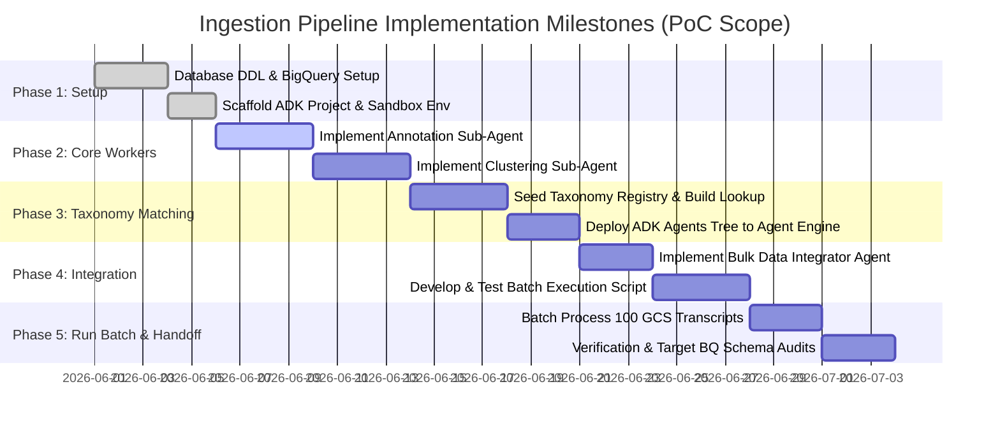

# Conversational Agent Transcript Analyzer & Ingestion Ingestion Pipeline
## GCP Architectural Proposal & ADK Implementation Plan (PoC Blueprint)

This document outlines the refined technical architecture and implementation plan for the **Conversational Agent Transcript Analyzer**. This self-contained Proof-of-Concept (PoC) is designed to process the 100 existing customer support call transcripts currently stored in a Google Cloud Storage (GCS) bucket and warehouse the analyzed outputs in Google BigQuery.

The pipeline utilizes the **Google Agent Development Kit (ADK)** and `gemini-2.5-pro` running within **Vertex AI Reasoning Engines (Agent Engine)** to dynamically annotate, cluster, classify, and persist call records in a clean, consolidated format.

---

## 1. System Ingestion & Batch Processing Pipeline

As a self-contained, scale-insensitive PoC, the ingestion flow is structured as a **static batch pipeline** rather than a live streaming model. The pipeline processes the 100 static JSON call logs already present in GCS.

### 1.1 GCP Infrastructure & Data Flow

The diagram below illustrates the batch processing and database warehousing workflow:

```mermaid
graph TD
    classDef gcp fill:#4285F4,stroke:#fff,stroke-width:2px,color:#fff;
    classDef runtime fill:#34A853,stroke:#fff,stroke-width:2px,color:#fff;
    classDef db fill:#EA4335,stroke:#fff,stroke-width:2px,color:#fff;

    %% Components
    GCS["🪣 Ingestion Bucket<br/>(genai-demos_synthetic_call_transcripts)"]:::gcp
    CR["🛠️ Cloud Run Ingest Job<br/>(Batch Execution Runner - Python)"]:::runtime
    AE["🧠 Vertex AI Agent Engine<br/>(ADK Orchestrator/Agents)"]:::runtime
    Gemini["✨ Vertex AI Gemini API<br/>(gemini-2.5-pro LLM)"]:::runtime
    Embeddings["🔤 Vertex Text Embeddings<br/>(text-embedding-004)"]:::runtime
    BQ["📊 BigQuery Warehouse Tables<br/>(call_analyzer.call_analyzer_table)"]:::db

    %% Flows
    CR -- "1. List & Fetch 100 Transcripts" --> GCS
    CR -- "2. Trigger ADK Workflow per Call" --> AE
    AE -- "3. Perform Dialogue Annotation" --> Gemini
    AE -- "4. Sequence Clustering & Duration Estimation" --> Gemini
    AE -- "5. Map Semantic Registry (Reuse Lookup)" --> Embeddings
    AE -- "6. Search & Upsert Intent Category" --> BQ
    AE -- "7. Verify & Format Nested Schema" --> Gemini
    CR -- "8. Bulk Load Structured Records" --> BQ

    style GCS class:gcp
    style CR class:runtime
    style AE class:runtime
    style Gemini class:runtime
    style Embeddings class:runtime
    style BQ class:db
```

### 1.2 Step-by-Step Data Flow

1. **Static Retrieval**: The Python ingest script executing on **Google Cloud Run** (or locally within the sandbox) connects to GCS, listing the 100 pre-populated synthetic telecom call files (e.g. [CALL-0095.json](file:///Users/wanderas/Documents/gcp/Synthetic%20Calls/transcripts/CALL-0095.json)) inside bucket **`genai-demos_synthetic_call_transcripts`**.
2. **Loop Iteration**: The script loops over the file array, reading each JSON record envelope and initiating the ADK **Orchestrator Agent**.
3. **Multi-Agent Processing**:
   - The annotation agent parses turns against Jurafsky DialogActs.
   - The clustering agent clusters turns and computes **activity/sequence durations** (cost metrics are ignored).
   - The taxonomy agent generates vector embeddings of intents using `text-embedding-004` and queries BigQuery database registry with vector distance parameters. If similarity matches above `0.80`, it **forces intent label reuse** to ensure a high-reuse consolidated taxonomy.
4. **Target Warehousing**: The normalized nested payloads are batched and written directly to BigQuery target table **`call_analyzer.call_analyzer_table`**.

---

## 2. ADK Hierarchical Agentic Framework Design

The agent tree utilizes the primary ADK Supervisor-Worker layout. An orchestrator coordinates four target sub-agents:

```mermaid
graph TD
    classDef orchestrator fill:#6366F1,stroke:#fff,stroke-width:2px,color:#fff;
    classDef worker fill:#06B6D4,stroke:#fff,stroke-width:2px,color:#fff;
    classDef tools fill:#10B981,stroke:#fff,stroke-width:2px,color:#fff;

    Root["👑 Root Orchestrator Agent<br/>(transcript_orchestrator)"]:::orchestrator
    
    Sub1["📝 Annotation Sub-Agent<br/>(damsl_annotator)"]:::worker
    Sub2["🧩 Sequence Clustering Agent<br/>(sequence_clustering_agent)"]:::worker
    Sub3["🏷️ Taxonomy Classifier Agent<br/>(taxonomy_classifier)"]:::worker
    Sub4["🔌 Data Integration Agent<br/>(data_ingestor)"]:::worker

    Tool1["🛠️ Stanford DAMSL Tool"]:::tools
    Tool2["🛠️ Semantic Registry Tool<br/>(Embedding Matching)"]:::tools
    Tool3["🛠️ BigQuery Ingestion Tool"]:::tools

    %% Hierarchy
    Root --> Sub1
    Root --> Sub2
    Root --> Sub3
    Root --> Sub4

    %% Sub-agent to Tool Maps
    Sub1 --> Tool1
    Sub3 --> Tool2
    Sub4 --> Tool3

    style Root class:orchestrator
    style Sub1 class:worker
    style Sub2 class:worker
    style Sub3 class:worker
    style Sub4 class:worker
    style Tool1 class:tools
    style Tool2 class:tools
    style Tool3 class:tools
```

### 2.1 Agent Role Specifications (Refined for PoC Constraints)

#### 2.1.1 Root Orchestrator Agent (`transcript_orchestrator`)
- **System Instruction**: Manages linear worker execution. Passes file inputs to the damsl annotator, routes annotations to the clustering agent, propagates clustering records to the taxonomy classifier, and aggregates results for database ingestion.

#### 2.1.2 Annotation Sub-Agent (`damsl_annotator`)
- **System Instruction**: Performs turn-by-turn DialogAct analysis matching Jurafsky DAMSL protocol. Constrained to output target segment lists: timestamp, speaker, text, dialogue act, and a 3-5 word conceptual abstractive title.

#### 2.1.3 Sequence Clustering Agent (`sequence_clustering_agent`)
- **System Instruction**: Groups consecutive conversational turns into activity sections (sequences). Calculates sequence **duration metrics only** by extracting elapsed seconds between sequence boundaries (financial $ operational cost calculations are completely bypassed).

#### 2.1.4 Taxonomy Classifier Agent (`taxonomy_classifier`)
- **System Instruction**: Computes call intents (Primary and Secondary layers). Aims for **high taxonomy reuse** by executing the custom embedding lookup tool with a low match-acceptance threshold of **`0.80`**, merging semantic synonyms (e.g. mapping *"Billing Disputes"* or *"Invoice Inquiries"* to a single registry index item *"Billing Queries"*).

#### 2.1.5 Data Integration Agent (`data_ingestor`)
- **System Instruction**: Gathers processing records, validates nested structures, formats inputs into BigQuery target schemas, and pushes writes to dataset **`call_analyzer`**.

---

## 3. PoC Code Templates (ADK, Python, and Batch Runner)

The templates are structured for a self-contained deployment using standard environment settings matching sandbox permissions.

### 3.1 `pyproject.toml`
Declares target packages for local development and Cloud Run job execution:

```toml
[project]
name = "transcript_analyzer"
version = "1.0.0"
dependencies = [
    "google-adk",
    "google-cloud-bigquery",
    "google-cloud-storage",
    "google-genai",
    "pandas",
    "db-dtypes",
    "pydantic"
]

[tool.agents-cli]
agent_directory = "app"
is_a2a = false
region = "us"
```

### 3.2 High-Reuse Taxonomy Ingestion Tool (`app/tools/taxonomy_tools.py`)
Matches proposed intent tags using native BigQuery cosine similarity vector functions:

```python
import logging
from typing import Dict, Any, List
from google.cloud import bigquery
from google import genai

logger = logging.getLogger("a2a_wrapper")

def get_text_embedding(text: str) -> List[float]:
    """Generates a 768-dimension vector embedding using text-embedding-004."""
    client = genai.Client()
    response = client.models.embed_content(
        model="text-embedding-004",
        contents=text
    )
    return response.embeddings[0].values

def semantic_taxonomy_lookup(primary: str, secondary: str, threshold: float = 0.80) -> Dict[str, Any]:
    """
    Looks up proposed intents in registry database using Vector Distance. Enforces a 0.80 similarity 
    threshold to group synonyms aggressively, optimizing category reuse.
    """
    client = bigquery.Client()
    proposed_label = f"{primary} - {secondary}"
    proposed_vector = get_text_embedding(proposed_label)
    
    # Cosine Similarity = 1 - cosine_distance. Enforces mapping to the closest match first.
    query = """
        SELECT primary_category, secondary_category, 
               (1 - ML.DISTANCE(category_embedding, @proposed_vec, 'COSINE')) AS similarity
        FROM `genai-demos-391416.call_analyzer.taxonomy_registry`
        ORDER BY similarity DESC
        LIMIT 1
    """
    
    job_config = bigquery.QueryJobConfig(
        query_parameters=[
            bigquery.ArrayQueryParameter("proposed_vec", "FLOAT64", proposed_vector)
        ]
    )
    
    try:
        query_job = client.query(query, job_config=job_config)
        results = list(query_job.result())
        
        if results and results[0].similarity >= threshold:
            match = results[0]
            logger.info(f"🧬 [High-Reuse] Semantic Match Found! Map '{proposed_label}' -> '{match.primary_category} - {match.secondary_category}' (Sim: {match.similarity:.4f})")
            return {
                "status": "matched",
                "primary": match.primary_category,
                "secondary": match.secondary_category,
                "similarity": match.similarity
            }
            
        # Register new unique categories when registry similarity drops below threshold
        logger.info(f"✨ Intent registry miss. Registering unique category '{proposed_label}'...")
        insert_query = """
            INSERT INTO `genai-demos-391416.call_analyzer.taxonomy_registry` 
            (primary_category, secondary_category, category_embedding)
            VALUES (@pri, @sec, @vec)
        """
        insert_job_config = bigquery.QueryJobConfig(
            query_parameters=[
                bigquery.ScalarQueryParameter("pri", "STRING", primary),
                bigquery.ScalarQueryParameter("sec", "STRING", secondary),
                bigquery.ArrayQueryParameter("vec", "FLOAT64", proposed_vector)
            ]
        )
        client.query(insert_query, job_config=insert_job_config).result()
        
        return {
            "status": "registered",
            "primary": primary,
            "secondary": secondary,
            "similarity": 1.0
        }
        
    except Exception as e:
        logger.error(f"❌ BigQuery registry error: {str(e)}")
        return {
            "status": "fallback",
            "primary": primary,
            "secondary": secondary,
            "similarity": 0.0
        }
```

### 3.3 Core Worker Instantiations (`app/agent.py`)
Excludes cost logic from worker prompts and targets outputs to `call_analyzer_table`:

```python
from google.adk.agents import Agent
from google.adk.tools import FunctionTool
from google.cloud import bigquery
from app.tools.taxonomy_tools import semantic_taxonomy_lookup

# --- Sub-Agent 1: Annotator ---
ANNOTATOR_PROMPT = """
You are the Dialogue Annotator. Read a telephone log and categorize turns turn-by-turn.
Assign Jurafsky Dialogue Acts (DAMSL standard):
- STATEMENT
- YES-NO-QUESTION, OPEN-QUESTION
- AGREEMENT, APPRECIATION, BACKCHANNEL
- CONVENTIONAL-OPENING, CONVENTIONAL-CLOSING
- APOLOGY, THANKING, ACCEPT, REJECT

Output target records containing timestamp, speaker, exact spoken text, dialogue act, and brief abstractive title.
"""
annotator_agent = Agent(
    name="damsl_annotator",
    instruction=ANNOTATOR_PROMPT,
    model="gemini-2.5-pro"
)

# --- Sub-Agent 2: Section Clustering Agent ---
CLUSTERING_PROMPT = """
You are the Sequence Clustering Agent. Group consecutive dialogue turns into section segments representing stages of the call.
Calculate the duration for each sequence segment based on timestamps.
IMPORTANT: Track and record only duration metrics (elapsed time in seconds). Do not calculate or map monetary $ operational cost values.
"""
clustering_agent = Agent(
    name="sequence_clustering_agent",
    instruction=CLUSTERING_PROMPT,
    model="gemini-2.5-pro"
)

# --- Sub-Agent 3: Intent Reuse Classifier ---
TAXONOMY_PROMPT = """
You are the Intent Classification Agent. Infer call reason intent at Primary (broad) and Secondary (granular) tiers.
To optimize catalog consistency, you MUST run tool `{@TOOL: semantic_taxonomy_lookup}` passing your proposed reasons.
Enforce classification reuse by adopting returned match labels if tool reports a semantic hit.
"""
taxonomy_agent = Agent(
    name="taxonomy_classifier",
    instruction=TAXONOMY_PROMPT,
    model="gemini-2.5-pro",
    tools=[FunctionTool(semantic_taxonomy_lookup)]
)

# --- Sub-Agent 4: Ingestion Loader ---
DATA_INGESTOR_PROMPT = """
You are the Data Loader Agent. Collect all metadata details, dialogue segment logs, structured sequence durations, and intent taxonomy layers.
Validate constraints and insert the record utilizing tool `{@TOOL: load_to_bigquery}`.
"""

def load_to_bigquery(bq_payload: dict) -> dict:
    """Writes structured transcript data into target analytics tables."""
    client = bigquery.Client()
    table_id = "genai-demos-391416.call_analyzer.call_analyzer_table"
    try:
        errors = client.insert_rows_json(table_id, [bq_payload])
        if errors:
            return {"status": "error", "details": str(errors)}
        return {"status": "success", "message": f"Persisted log record {bq_payload.get('call_id')}"}
    except Exception as e:
        return {"status": "error", "details": str(e)}

data_agent = Agent(
    name="data_ingestor",
    instruction=DATA_INGESTOR_PROMPT,
    model="gemini-2.5-flash",
    tools=[FunctionTool(load_to_bigquery)]
)

# --- Root Supervisor Orchestrator Agent ---
ORCHESTRATOR_PROMPT = """
You are the Primary Orchestrator. Process transcript documents step-by-step:
1. Route inputs to `{@AGENT: damsl_annotator}` to map acts.
2. Route outputs to `{@AGENT: sequence_clustering_agent}` to cluster sequences and compute durations.
3. Route sequences to `{@AGENT: taxonomy_classifier}` to calculate intent reasons and match standard labels.
4. Route final records to `{@AGENT: data_ingestor}` to write data to target BigQuery tables.
"""
root_agent = Agent(
    name="transcript_orchestrator",
    instruction=ORCHESTRATOR_PROMPT,
    model="gemini-2.5-pro",
    sub_agents=[annotator_agent, clustering_agent, taxonomy_agent, data_agent]
)
```

### 3.4 PoC Batch Processing Execution Script (`batch_runner.py`)
This standalone script executes the batch process, iterating over the 100 files inside bucket `genai-demos_synthetic_call_transcripts` and calling the ADK orchestrator agent.

```python
import json
import logging
import asyncio
from google.cloud import storage
from google.adk.agents import RunConfig
from app.agent import root_agent

logging.basicConfig(level=logging.INFO)
logger = logging.getLogger("batch_runner")

async def process_call_transcript(blob_name: str, file_content: str):
    """Feeds file data to the ADK orchestrator backend in an isolated execution turn."""
    logger.info(f"🚀 Processing transcript file: '{blob_name}'...")
    try:
        call_data = json.loads(file_content)
        
        # Build prompt payload passing call details and turns
        input_payload = {
            "metadata": call_data.get("metadata", {}),
            "transcript": call_data.get("transcript", [])
        }
        
        # Execute the ADK orchestrator agent run session
        run_config = RunConfig()
        result_stream = root_agent.run_async(
            parent_context=None # Initialized dynamically as root entry
        )
        
        async for event in result_stream:
            # Trace agent run logs in console
            if event.content and event.content.parts:
                text_part = "".join([p.text for p in event.content.parts if p.text])
                if text_part.strip():
                    logger.debug(f"[{event.author}]: {text_part.strip()}")
                    
        logger.info(f"✅ Finished analysis for file: '{blob_name}'")
    except Exception as e:
        logger.error(f"❌ Failed to process blob '{blob_name}': {str(e)}")

async def run_batch_poc():
    """Iterates and runs transcript processing on all 100 call records inside GCS bucket."""
    bucket_name = "genai-demos_synthetic_call_transcripts"
    storage_client = storage.Client()
    
    logger.info(f"📂 Scanning GCS bucket '{bucket_name}' for pre-loaded transcripts...")
    bucket = storage_client.bucket(bucket_name)
    blobs = list(bucket.list_blobs())
    
    logger.info(f"🎯 Target files found: {len(blobs)}. Commencing PoC batch run...")
    
    # Process files sequentially to stay within model API rate limits for the PoC
    for i, blob in enumerate(blobs):
        logger.info(f"\n--- [Call {i+1} / {len(blobs)}] ---")
        file_content = blob.download_as_text()
        await process_call_transcript(blob.name, file_content)
        
    logger.info("\n🏁 PoC batch processing successfully completed! Check your BigQuery tables.")

if __name__ == "__main__":
    asyncio.run(run_batch_poc())
```

---

## 4. BigQuery Data Warehouse & Registry Schema

Denormalized schematics isolate historical logs into target tables. Cost parameters have been deleted.

### 4.1 Schema DDL for Call Analytics (`call_analyzer_table`)
Contains transcript records and nested sequence segments matching target structures:

```sql
CREATE OR REPLACE TABLE `genai-demos-391416.call_analyzer.call_analyzer_table` (
    -- Metadata Details
    call_id STRING NOT NULL,
    customer_id STRING NOT NULL,
    customer_name STRING,
    customer_type STRING,
    phone STRING,
    email STRING,
    services STRING,
    duration_minutes INT64,
    total_turns INT64,
    processed_timestamp TIMESTAMP DEFAULT CURRENT_TIMESTAMP(),
    
    -- High-Reuse Intent Registry Details
    primary_reason STRING NOT NULL,
    secondary_reason STRING NOT NULL,
    
    -- Clustering Stage Records (Operational Costs Excluded)
    sequences ARRAY<STRUCT<
        sequence_name STRING,
        est_duration_seconds FLOAT64,
        turns ARRAY<STRUCT<
            timestamp STRING,
            speaker STRING,
            text STRING,
            dialogue_act STRING,
            abstractive_title STRING
        >>
    >>
);
```

### 4.2 Schema DDL for Taxonomy Registry (`taxonomy_registry`)
Matches categories against corresponding vector definitions:

```sql
CREATE OR REPLACE TABLE `genai-demos-391416.call_analyzer.taxonomy_registry` (
    primary_category STRING NOT NULL,
    secondary_category STRING NOT NULL,
    category_embedding ARRAY<FLOAT64> NOT NULL, -- 768-dimension vector
    created_at TIMESTAMP DEFAULT CURRENT_TIMESTAMP()
);
```

---

## 5. Development Ingestion & Implementation Plan (PoC Scope)

GCS event hooks, Pub/Sub triggers, and scalability tasks have been removed from the schedule.

### Ingestion & Development Timeline


### 5.1 Milestone Breakdown

#### Phase 1: Target Definitions & Project Inits (5 Days)
- Execute BigQuery DDL schemas to create dataset `call_analyzer`, table `call_analyzer_table`, and `taxonomy_registry` registry table.
- Initialize the target local directory structure using `setup_agents_project.sh` to generate python workspaces and link packages.

#### Phase 2: Dialogue & Cluster Workers Construction (8 Days)
- Code instructions for `damsl_annotator` validating exact Jurafsky act classifications against test file inputs.
- Implement the sequence clustering agent. Track segment boundaries and output **durations in seconds** (avoiding any dollar operational costing equations).

#### Phase 3: Intent Deduplication & Deployment (7 Days)
- Seed `taxonomy_registry` table using standard primary classifications: *Account and PIN questions*, *Billing problems*, *Technical issues*, *New orders*, and *Payments*.
- Construct the `semantic_taxonomy_lookup` tool. Set matching parameter thresholds at **`0.80`** to support high classification reuse, merging synonym tags during testing.
- Deploy the complete supervisor agent configuration to **Vertex AI Reasoning Engines**.

#### Phase 4: Batch Integrator & Ingest Run (7 Days)
- Code `data_ingestor` sub-agent. Link standard BQ ingestion libraries.
- Write the final `batch_runner.py` execution script. Configure loops, download blob functions, payload variables, and error limits.

#### Phase 5: Verification & Delivery (6 Days)
- Run the executable script on the 100 transcripts in bucket `genai-demos_synthetic_call_transcripts`.
- Review BigQuery logs to audit target dataset properties.
- Compile final extraction graphs and hand off target deliverables.

---

## 6. Security, Threat Modeling & Observability

### 6.1 IAM Permissions
Processing service profiles use static, least-privilege target mappings:
- **Cloud Storage (GCS)**: `roles/storage.objectViewer` assigned to bucket `genai-demos_synthetic_call_transcripts` (enables file retrieval, blocks upload/deletion).
- **Vertex AI**: `roles/aiplatform.user` assigned on target models.
- **BigQuery**: `roles/bigquery.dataEditor` assigned to database dataset `call_analyzer`.

### 6.2 Data Protections
- **Escaped Utterances**: conversational blocks processed inside transcripts are cast to raw string parameters. This blocks structural modifications or prompt injections at the models interface.
- **Pydantic Validation Guardrails**: Payload parameters are strictly validated using model schemas at the ingestion point, preventing database loading exceptions.

### 6.3 Logging Telemetry
- Pipeline events, model calls, execution loops, and registry misses are written directly to local application logs and **Google Cloud Logging** using standard logging wrappers.
- Execution metrics record the processing duration for each file, tracking API speeds during run cycles.

---

## 7. Operational Status & Design Alignments

The architecture aligns with the custom design choices selected for this project:

1. **High Classification Reuse Enforced**: Vector similarity registry matches mapping parameters above **`0.80`** similarity. Synonyms are resolved to target indexes, maintaining taxonomy alignment.
2. **Duration-Only Clustering Confirmed**: Sections are clustered and durations tracked in seconds. Monetary cost estimations are removed.
3. **Static Batch Execution Validated**: Scale concerns, event tracking triggers, webhooks, Eventarc modules, and buffering parameters are removed. The system is engineered exclusively to process the 100 static GCS logs in one batch execution run.

---

> [!NOTE]
> High-quality source references from Stanford University DAMSL protocols ([Stanford Jurafsky Reference Paper](https://web.stanford.edu/~jurafsky/ws97/CL-dialog.pdf)) are strictly integrated as system instructions.
